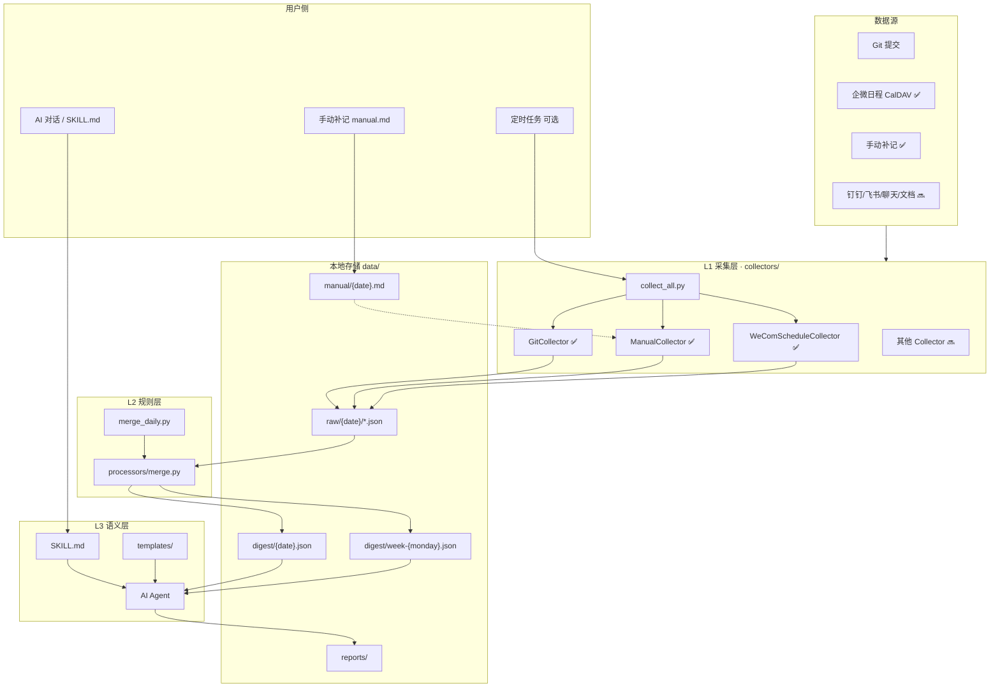
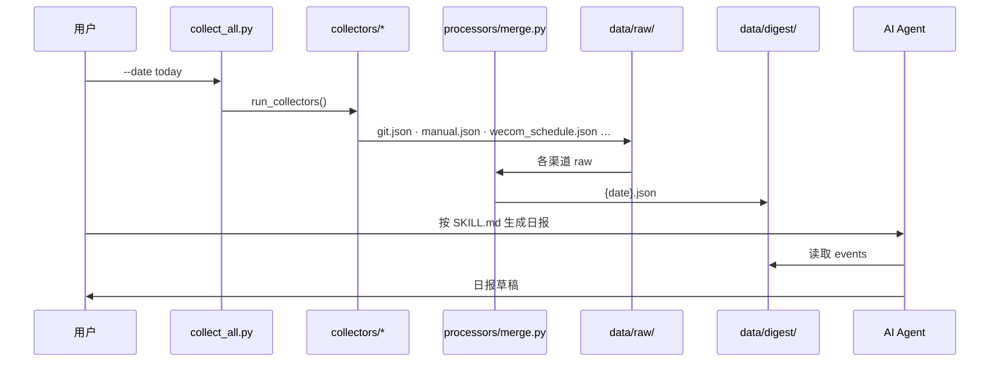

# daily-work-digest — 技术文档

> 版本：v1.0 · 2026-06-18  
> 本文档涵盖：项目定位、系统架构、技术选型、实现方案、数据模型、路线图与风险。  
> 用户使用说明见 [README.md](../README.md)、[快速开始.md](./快速开始.md)。

---

## 1. 背景与目标

### 1.1 要解决的问题

- 写日报、周报时想不起当天具体做了什么
- 工作分散在代码、会议、沟通等多个渠道，手工回忆易遗漏
- 协作类、会议类工作往往没有 Git 痕迹

### 1.2 项目目标

| 目标 | 说明 |
|------|------|
| **多源采集** | 从 Git、日历、手动补记等渠道拉取当日工作线索 |
| **结构化存储** | 按日落盘到本地 `data/`，可回溯、可汇总 |
| **Skill 成文** | AI 助手读取 digest，按 `SKILL.md` 生成日报/周报，**禁止编造** |
| **可扩展** | 新数据源以 Adapter 接入，不改动主流程 |

### 1.3 非目标

- 不替代 Jira / 项目管理工具
- 不全量备份聊天记录、不上传云端（默认本地优先）
- 不单独部署 Web 服务或数据库

### 1.4 核心原则

**Skill 负责编排**（调什么脚本、读什么文件、怎么写）；**采集与持久化由 Python + 本地文件完成**。

---

## 2. 总体架构

### 2.1 系统总览



**图例**：✅ 已实现 · 🔜 规划中

### 2.2 三层分工

参考 `daily-china-hot-news-digest` 的分层模式：

| 层级 | 执行者 | 职责 | 关键入口 |
|------|--------|------|----------|
| **L1 采集** | Python CLI | 各渠道 Adapter 拉原始数据 | `collect_all.py` → `collectors/` |
| **L2 规则** | Python CLI | 归并、去重、打标签、过滤 | `merge_daily.py` → `processors/merge.py` |
| **L3 成文** | AI Agent + `SKILL.md` | 读 digest + 模板生成日报/周报 | `SKILL.md`、`templates/` |

```
┌─────────────────────────────────────────────────────────────┐
│  L3  SKILL.md + Agent + templates/     ← 无运行时，纯编排    │
├─────────────────────────────────────────────────────────────┤
│  L2  merge_daily.py → processors/merge.py  ← 归并 / 打标     │
├─────────────────────────────────────────────────────────────┤
│  L1  collect_all.py → collectors/*     ← Adapter 基类 + 各渠道 │
├─────────────────────────────────────────────────────────────┤
│  存储  data/raw · digest · manual      ← JSON + Markdown     │
├─────────────────────────────────────────────────────────────┤
│  配置  config.yaml                     ← 仓库、时区、凭证    │
└─────────────────────────────────────────────────────────────┘
```

### 2.3 单日数据流



**步骤**：

1. 手动或定时触发 `collect_all.py`
2. L1：各 Collector 写入 `data/raw/{date}/`
3. L2：`merge_daily.py` 生成 `data/digest/{date}.json`
4. L3：AI 助手按 `SKILL.md` 读 digest + 模板成文
5. 遗漏项写入 `manual/` → 重新 merge → 再次成文

**周报**：`python scripts/merge_daily.py --date today --week` → `data/digest/week-{周一}.json`

---

## 3. 技术选型

### 3.1 选型原则

| 原则 | 说明 |
|------|------|
| 本地优先 | 数据落盘本机，`data/` 默认 gitignore |
| 轻量可维护 | 少依赖、一人可维护 |
| 与 AI 助手协同 | 脚本产出 JSON，Agent 读 `SKILL.md` 与 digest 成文 |
| 可扩展 | 新渠道加 Collector，不换架构 |

### 3.2 技术栈

| 层次 | 技术 | 用途 |
|------|------|------|
| 编排 / 成文 | `SKILL.md` + AI Agent | 触发采集、读 digest、按模板成文 |
| 采集 / 规则 | Python 3.10+ · argparse | L1/L2 CLI |
| 配置 | YAML（PyYAML） | 仓库、过滤规则、CalDAV 凭证 |
| 存储 | JSON + Markdown | raw/digest / manual/reports |
| Git 读取 | subprocess 调 `git` | 不用 GitPython |
| CalDAV | httpx + icalendar | 企微日程（直连，无 caldav 包） |
| 定时 | Windows 任务计划 / IDE Automations | 可选 |

**MVP 依赖**（`requirements.txt`）：

```
PyYAML>=6.0
python-dateutil>=2.8
tzdata>=2024.1
httpx
icalendar
```

**刻意不用**：Web 框架、数据库、Docker、独立 LLM API（用用户所选 AI 助手内置 Agent）。

### 3.3 为什么用 Python

- 核心是 Git、文件、YAML、Cursor Skill，Python CLI 足够轻
- 与现有 `daily-china-hot-news-digest` 技能模式一致
- 二期按需引入 `httpx` 等，不提前堆栈

---

## 4. 项目结构

```
daily-work-digest/
├── SKILL.md                      # Agent 技能说明（name: daily-work-digest）
├── README.md                     # 用户向说明
├── config.yaml                   # 用户配置（gitignore）
├── config.example.yaml
├── requirements.txt
├── scripts/
│   ├── collect_all.py            # L1 对外入口
│   ├── collect_git.py            # 兼容 CLI（--sources git）
│   ├── merge_daily.py            # L2 对外入口
│   ├── collectors/               # L1 Adapter
│   │   ├── base.py               # BaseCollector
│   │   ├── git.py
│   │   ├── manual.py
│   │   ├── wecom_schedule.py
│   │   └── calendar/caldav_client.py
│   ├── processors/
│   │   └── merge.py
│   └── utils/
├── data/                         # 本地数据（gitignore）
│   ├── raw/YYYY-MM-DD/
│   ├── digest/
│   ├── manual/
│   └── reports/
├── templates/
│   ├── daily.md
│   └── weekly.md
└── docs/
    ├── 技术文档.md               # 本文档
    ├── 快速开始.md
    ├── 手动补记示例.md
    └── 企微日程采集-用户指南.md
```

---

## 5. 数据源与 Adapter

Git **只是渠道之一**；各渠道独立采集，统一 Event 模型，经 L2 归并。

| 数据源 | 优先级 | Collector | 状态 | 采集方式 |
|--------|--------|-----------|------|----------|
| Git 提交 | P0 | `git.py` | ✅ | `git log` 本地扫描 |
| 手动补记 | P0 | `manual.py` | ✅ | 读 `data/manual/*.md` |
| 企微日程 | P1 | `wecom_schedule.py` | ✅ | CalDAV → `caldav.wecom.work` |
| PR / Issue | P1 | `issue.py` | 🔜 | `gh` / API |
| 钉钉/飞书日程 | P1 | 复用 `caldav_client.py` | 🔜 | 各平台 CalDAV |
| 飞书/钉钉/企微聊天 | P2 | `chat.py` | 🔜 | 导出 / 企业 API |
| 语雀/Confluence | P2 | `docs.py` | 🔜 | 开放平台 API |
| Jira/Linear | P3 | — | 🔜 | REST API |

### 5.1 Adapter 模式

```python
class BaseCollector(ABC):
    source: ClassVar[str]           # 如 "git"
    output_filename: ClassVar[str]  # 如 "git.json"

    def collect(self, date_str) -> dict: ...   # 子类实现
    def run(self, date_str) -> Path: ...        # 写 raw + 日志
```

**扩展步骤**：继承 `BaseCollector` → 在 `collectors/__init__.py` 注册 → 输出 `data/raw/{date}/{source}.json` → 在 `processors/merge.py` 增加转换逻辑。

### 5.2 Git 采集要点

- 输入：`config.yaml` → `git.repos`（业务项目绝对路径，**不要**填本工具目录）
- 内容：hash、时间、作者、message、变更统计、分支
- 过滤：merge commit、`exclude_patterns`（wip/temp 等）、可选 `author_email`

### 5.3 企微 CalDAV 要点

- 协议：CalDAV（非手机页 Exchange 的 `wecom.work`）
- 服务器：`https://caldav.wecom.work`
- 凭证：手机「同步至其他日历」专用密码
- 实现：`wecom_schedule.py` → `calendar/caldav_client.py`（httpx + PROPFIND/GET）
- 用户配置见 [企微日程采集-用户指南.md](./企微日程采集-用户指南.md)

---

## 6. 数据模型

### 6.1 统一 Event

所有渠道归一为 Event，写入 digest：

```json
{
  "date": "2026-06-18",
  "timezone": "Asia/Shanghai",
  "events": [
    {
      "id": "git-be5428b",
      "time": "11:54:25",
      "source": "git",
      "type": "commit",
      "title": "feat: 支持报告增补更新",
      "detail": "repo: WdDataAgent, files: 16, +462/-50",
      "url": "",
      "tags": ["开发", "功能"],
      "raw": {}
    },
    {
      "id": "cal-xxx",
      "time": "14:00:00",
      "source": "wecom",
      "type": "meeting",
      "title": "项目评审",
      "detail": "时长: 60 分钟",
      "tags": ["会议", "协作"],
      "raw": {}
    }
  ],
  "summary": {
    "total_events": 2,
    "by_source": { "git": 1, "wecom": 1 },
    "by_tag": { "开发": 1, "会议": 1 }
  }
}
```

| 字段 | 说明 |
|------|------|
| `source` | `git` / `manual` / `wecom` / `chat` / `docs` / `calendar` / `issue` |
| `type` | `commit` / `note` / `meeting` / `doc_edit` / `pr` 等 |
| `tags` | 成文分组：开发、协作、文档、会议、学习 |
| `raw` | 原始 payload，便于调试 |

### 6.2 存储分层

| 路径 | 内容 |
|------|------|
| `data/raw/{date}/` | 各渠道原始 JSON（如 `git.json`、`wecom_schedule.json`） |
| `data/manual/{date}.md` | 用户手写补记 |
| `data/digest/{date}.json` | L2 归并后 events |
| `data/digest/week-{monday}.json` | 周报汇总 |
| `data/reports/` | Agent 成稿归档（可选） |

---

## 7. L2 规则层

| 能力 | 规则 |
|------|------|
| **去重** | 相同 `id` 只保留一条；URL 相同的 chat/doc 合并 |
| **合并** | 同 PR 多 commit → 一条；同文档多次编辑 → 合并摘要 |
| **打标签** | `fix`→bugfix；`feat`→功能；manual 含「会议」→协作；规则可配 `config.yaml` → `tags` |
| **过滤** | merge commit、`exclude_patterns` |
| **周报** | `--week` 合并周一至周日 daily digest |

---

## 8. L3 Skill 层

### 8.1 元数据

```yaml
---
name: daily-work-digest
description: |
  从多维度采集并汇总日常工作内容，生成日报、周报。
  当用户说「生成今天的工作日报」「写周报」等时使用。
tags: [工作日报, 周报, 工作内容, 多源采集]
version: 1.0
---
```

### 8.2 Agent 流程

1. **环境检测**：Python、依赖、`config.yaml`
2. **采集**：若无 digest 或用户要求刷新 → `collect_all.py` / `merge_daily.py`
3. **读取**：`data/digest/{date}.json`、`manual/{date}.md`、`templates/daily.md` 或 `weekly.md`
4. **成文**：仅基于已有 events；commit message 改写为业务语言；按 tags 分组
5. **补全**：询问遗漏 → 写入 manual → 重新 merge

### 8.3 硬性规则

- **禁止编造** digest/manual 中不存在的工作项
- **禁止**将 raw 数据上传外部（除非用户明确要求）
- 企微 CalDAV 只读，不同步到第三方日历

### 8.4 输出模板

- `templates/daily.md` — 日报结构（今日完成 / 进行中 / 明日计划 / 风险）
- `templates/weekly.md` — 周报结构（本周成果 / 下周计划 / 问题风险）

模板中的占位由 Agent 按 digest 填充，无需模板引擎。

---

## 9. 配置与安全

### 9.1 主要配置项

```yaml
timezone: Asia/Shanghai

git:
  repos: [D:/javaPro/your-project]
  author_email: ""
  exclude_patterns: ["^Merge ", "^wip"]

manual:
  enabled: true

wecom:
  enabled: true
  caldav:
    server: https://caldav.wecom.work
    username: "user@corp.wecom.work"
    password: "..."
    calendar_id: ""   # 可选，403 时可填

tags:
  commit_fix: ["开发", "bugfix"]
  manual_meeting: ["会议", "协作"]
```

### 9.2 安全

- `config.yaml` 含密码/Token 时 **不得提交 Git**
- `data/` 默认本地存储
- 聊天/文档采集遵循「最小必要」：标题、链接、时间，不存全文

---

## 10. 脚本与 CLI

| 脚本 | 层级 | 说明 |
|------|------|------|
| `collect_all.py` | L1 入口 | 调度 Collector，可选归并 |
| `collectors/*.py` | L1 实现 | 各渠道 Adapter |
| `merge_daily.py` | L2 入口 | 调用 `processors/merge.py` |
| `processors/merge.py` | L2 实现 | raw → digest |

```bash
# 推荐：采集 + 归并
python scripts/collect_all.py --date today

# 仅采集指定渠道
python scripts/collect_all.py --date today --collect-only --sources git,manual,wecom

# 仅归并
python scripts/merge_daily.py --date today
python scripts/merge_daily.py --date today --week

# 兼容旧命令
python scripts/collect_git.py --date today
```

---

## 11. 实施路线图

| 阶段 | 内容 | 状态 |
|------|------|------|
| Phase 0 | 目录、配置、gitignore | ✅ |
| Phase 1 | Git、manual、merge、Skill、模板 | ✅ |
| Phase 2 | 周报、`collect_all`、企微 CalDAV | ✅ |
| Phase 2+ | 定时采集、commit 语义优化 | 🔜 |
| Phase 3 | 钉钉/飞书 CalDAV、聊天、文档、PR/Issue | 🔜 |
| Phase 4 | Jira、Web UI、导出公司模板 | 🔜 |

---

## 12. 风险与对策

| 风险 | 对策 |
|------|------|
| `git.repos` 配错 | 指向有 `.git` 的业务项目 |
| commit message 质量差 | L3 结合 diff stat 改写 |
| 企微 CalDAV 403 | 重新获取同步密码；配置 `calendar_id`；见用户指南 |
| 聊天/文档无 API 权限 | 依赖 manual 补记 |
| Agent 编造 | Skill 硬性禁止 |
| 隐私 | 本地存储、`data/` gitignore |
| 时区混乱 | 统一 `config.timezone`，按本地日切割 |

---

## 13. 与 daily-china-hot-news-digest 的关系

| 对比项 | 热榜 Skill | daily-work-digest |
|--------|------------|-------------------|
| L1 | 各平台 fetch | Git / manual / 日历 Adapter |
| L2 | post_process 去重 | merge_daily 归并打标 |
| L3 | Agent 写热点报告 | Agent 写日报/周报 |
| 原则 | 禁止编造条目 | 禁止编造工作项 |

---

## 14. 修订记录

| 版本 | 日期 | 说明 |
|------|------|------|
| v1.0 | 2026-06-18 | 合并原「架构图」「设计文档」为单一技术文档；项目更名 daily-work-digest |

---

*文档结束*
